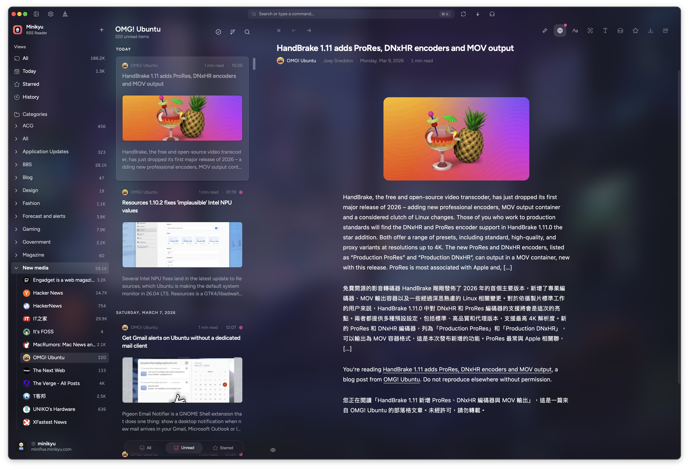

# Minikyu

**English** | [简体中文](README.zh-CN.md) | [繁體中文](README.zh-TW.md) | [日本語](README.ja.md) | [한국어](README.ko.md)

[](LICENSE.md)
[](https://github.com/sinhong2011/minikyu/actions/workflows/ci.yml)
[](https://github.com/sinhong2011/minikyu/stargazers)

A modern RSS reader desktop application built with **Tauri v2**, **React 19**, and **TypeScript**. Fast, native, and cross-platform.

## Screenshots



## Features

- 📰 **RSS Feed Management** - Subscribe, organize by categories, OPML import/export
- 🎧 **Podcast Player** - Built-in audio player with playback controls, accessible from toolbar and command palette
- 🔍 **Command Palette** - Quick access to all actions with `Cmd+K`, including theme/language switching
- ⌨️ **Keyboard Shortcuts** - Extensive shortcuts for navigation, reading, and actions
- 🧘 **Zen Mode** - Distraction-free reading experience (toggle with `Z`)
- 📖 **Focus Mode** - Immersive article reading with a single shortcut
- 🎨 **Theming & Appearance** - Light/Dark/System themes, custom background images, transparency, and frosted glass effects
- 🌐 **Multi-language** - English, Chinese (Simplified/Traditional), Japanese, Korean
- 🌏 **AI Translation** - LLM-powered article translation with configurable providers
- 👆 **Gesture Controls** - Configurable swipe gestures for navigation and actions, pull-to-refresh
- 🪟 **Quick Pane** - Global shortcut floating window for quick access from anywhere
- 🔄 **Sync & Auto-updates** - Real-time Miniflux sync with progress tracking, automatic app updates
- 🖥️ **Cross-platform** - macOS, Windows, and Linux support

## Installation

### Prerequisites

- [Bun](https://bun.sh) - Package manager
- [Rust](https://www.rust-lang.org/) - Latest stable version
- [Tauri dependencies](https://tauri.app/start/prerequisites/) - Platform-specific requirements

### Quick Start

```bash
# Clone the repository
git clone https://github.com/sinhong2011/minikyu.git
cd minikyu

# Install dependencies
bun install

# Install git hooks
bun run lefthook

# Start development server
bun run dev
```

### Build for Production

```bash
bun run tauri build
```

## Tech Stack

| Layer    | Technologies                                  |
| -------- | --------------------------------------------- |
| Frontend | React 19, TypeScript, Vite 7, Bun             |
| UI       | shadcn/ui v4, Tailwind CSS v4                 |
| Routing  | TanStack Router v1 (file-based)               |
| State    | Zustand v5, TanStack Query v5                 |
| Backend  | Tauri v2, Rust                                |
| Testing  | Vitest v4, Testing Library                    |
| Quality  | Biome, ast-grep, clippy, Lefthook, Commitlint |

## Documentation

- **[Developer Docs](docs/developer/)** - Architecture, patterns, and detailed guides
- **[User Guide](docs/userguide/)** - End-user documentation

## License

[MIT](LICENSE.md)

Third-party dependency notices: [THIRD_PARTY_NOTICES.md](THIRD_PARTY_NOTICES.md)

## Star History

<a href="https://www.star-history.com/#sinhong2011/minikyu&type=timeline&legend=bottom-right">
 <picture>
   <source media="(prefers-color-scheme: dark)" srcset="https://api.star-history.com/svg?repos=sinhong2011/minikyu&type=timeline&theme=dark&legend=top-left" />
   <source media="(prefers-color-scheme: light)" srcset="https://api.star-history.com/svg?repos=sinhong2011/minikyu&type=timeline&legend=top-left" />
   
 </picture>
</a>

---

Built with [Tauri](https://tauri.app) | [shadcn/ui](https://ui.shadcn.com) | [React](https://react.dev)
