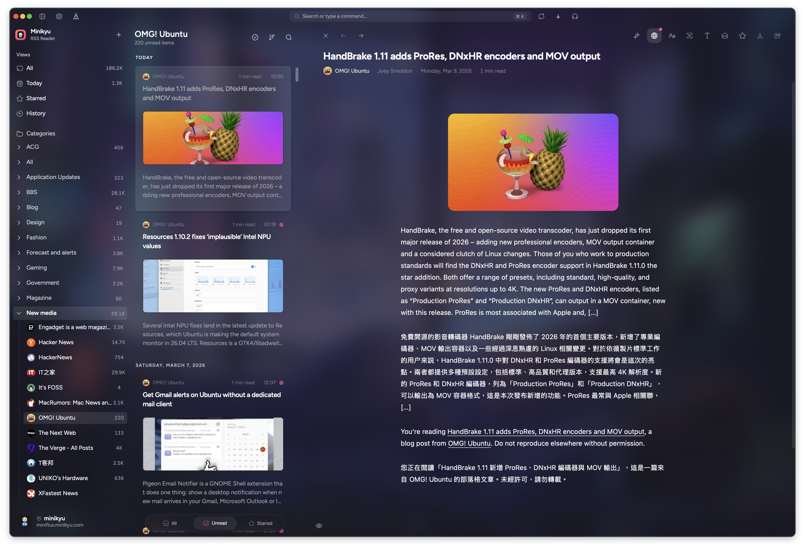

# Minikyu

**English** | [简体中文](README.zh-CN.md) | [繁體中文](README.zh-TW.md) | [日本語](README.ja.md) | [한국어](README.ko.md)

[](LICENSE.md)
[](https://github.com/sinhong2011/minikyu/actions/workflows/ci.yml)
[](https://github.com/sinhong2011/minikyu/stargazers)
[](https://hub.docker.com/r/sinhong2011/minikyu-web)

A modern, beautiful client for [Miniflux](https://miniflux.app) — the minimalist and opinionated RSS reader. Built with **Tauri v2**, **React 19**, and **TypeScript**.

One codebase ships two apps: a **native desktop app** for macOS, Windows and Linux, and an **installable PWA** you can self-host and open in any browser, phone included.

> **Note:** Minikyu requires a running [Miniflux](https://miniflux.app) instance (self-hosted or cloud) as its backend. Miniflux handles feed fetching, parsing, and storage — Minikyu provides the rich desktop experience on top of it.

## Screenshots




## Features

- 📰 **RSS Feed Management** - Subscribe, organize by categories, OPML import/export
- 🎧 **Podcast Player** - Built-in audio player with playback controls, accessible from toolbar and command palette
- 🔍 **Command Palette** - Quick access to all actions with `Cmd+K`, including theme/language switching
- ⌨️ **Keyboard Shortcuts** - Extensive shortcuts for navigation, reading, and actions
- 🧘 **Zen Mode** - Distraction-free reading experience (toggle with `Z`)
- 📖 **Focus Mode** - Immersive article reading with a single shortcut
- 🎨 **Theming & Appearance** - Light/Dark/System themes, custom background images (local file or URL), opacity/blur/tiling controls, transparency, and frosted glass effects
- 🌐 **Multi-language** - English, Chinese (Simplified/Traditional), Japanese, Korean
- 🌏 **AI Translation** - LLM-powered article translation with configurable providers
- 👆 **Gesture Controls** - Configurable swipe gestures for navigation and actions, pull-to-refresh
- 🪟 **Quick Pane** - Global shortcut floating window for quick access from anywhere
- ☁️ **Cloud Sync** - Back up and sync preferences across devices via S3-compatible storage or WebDAV, with debounced auto-push and optional pull on startup
- 🔄 **Sync & Auto-updates** - Real-time Miniflux sync with progress tracking, automatic app updates
- 🖥️ **Cross-platform** - macOS, Windows, and Linux support
- 🌍 **Installable PWA** - The same reader in the browser: add to home screen, works on phones and tablets. Online-only — see [PWA docs](docs/developer/pwa.md)
- 📱 **Responsive UI** - Phone layout with a bottom tab bar for one-thumb navigation; the drawer holds categories and feeds

## Installation

### Prerequisites

- [Bun](https://bun.sh) 1.4 - Package manager and runtime (pinned in `mise.toml`)
- A running [Miniflux](https://miniflux.app) instance
- For the **desktop** build only:
  - [Rust](https://www.rust-lang.org/) - Latest stable version
  - [Tauri dependencies](https://tauri.app/start/prerequisites/) - Platform-specific requirements

The **web** build needs neither Rust nor the Tauri toolchain.

### Quick Start

```bash
# Clone the repository
git clone https://github.com/sinhong2011/minikyu.git
cd minikyu

# Install dependencies
bun install

# Install git hooks
bun run lefthook

# Start development server (desktop)
bun run dev

# …or the browser build, pointed at your Miniflux instance
VITE_MINIFLUX_API_BASE=https://reader.example.com bun run dev:web
```

### Build for Production

```bash
bun run tauri build     # desktop binaries for the current platform
bun run build:web       # static PWA → dist/
```

## Deploy the web app

The `web` target builds to a static `dist/` and is the whole reader in a
browser — installable, phone-friendly, no desktop install required.

[](https://app.netlify.com/start/deploy?repository=https://github.com/sinhong2011/minikyu)
[](https://vercel.com/new/clone?repository-url=https://github.com/sinhong2011/minikyu&env=MINIFLUX_URL&envDescription=Your%20Miniflux%20instance%20URL%2C%20e.g.%20https%3A%2F%2Freader.example.com&envLink=https://github.com/sinhong2011/minikyu/blob/main/docs/developer/pwa.md)
[](https://deploy.workers.cloudflare.com/?url=https://github.com/sinhong2011/minikyu)

The Cloudflare button deploys a Worker that serves the static build and proxies
`/miniflux-api/`. Its **Deploy command** is pre-filled from this repo's `deploy`
script, which runs the web build itself — so leave the **Build command** empty
(or set it to `bun run build:cf`) rather than the desktop-target default. Add
`MINIFLUX_URL` afterwards under Settings → Variables and secrets as a **secret**,
so the next deploy keeps it.

### One variable to set: `MINIFLUX_URL`

```
MINIFLUX_URL = https://reader.example.com
```

**This is required, and the deploy will not work without it.** Miniflux sends no
CORS headers, so a browser can never call it directly. The PWA instead calls the
same-origin path `/miniflux-api/...` and the deployment proxies that to your
instance:

```
browser ──▶ /miniflux-api/v1/entries ──▶ https://reader.example.com/v1/entries
            (your deployment)             (your Miniflux)
```

Because the proxy fixes the target, the **Server URL field in the app is display-only**
on web — the API token is what matters. Sign in with a scoped token from
Miniflux → Settings → API Keys, which you can revoke without changing your password.

| Host | How the proxy is wired | Config |
| ---- | ---------------------- | ------ |
| Netlify | `_redirects`, generated at build time from `MINIFLUX_URL` | [`netlify.toml`](netlify.toml) |
| Vercel | Edge function (`vercel.json` cannot interpolate env vars) | [`vercel.json`](vercel.json), [`api/miniflux-api.ts`](api/miniflux-api.ts) |
| Cloudflare Workers | Worker in front of the static assets | [`wrangler.jsonc`](wrangler.jsonc), [`cloudflare/worker.ts`](cloudflare/worker.ts) |
| Docker | nginx in the image, configured from `MINIFLUX_URL` at start | [`sinhong2011/minikyu-web`](https://hub.docker.com/r/sinhong2011/minikyu-web), [`Dockerfile`](Dockerfile), [`docker-compose.yml`](docker-compose.yml) |
| nginx / Caddy | Reverse proxy you control | [PWA docs](docs/developer/pwa.md#production) |

### Self-hosting it yourself

With Docker — the image serves the PWA behind an nginx that already proxies
`/miniflux-api/`. Published for `linux/amd64` and `linux/arm64`:

```bash
docker run -p 8085:80 -e MINIFLUX_URL=https://reader.example.com \
  sinhong2011/minikyu-web
```

The image is published to [Docker Hub](https://hub.docker.com/r/sinhong2011/minikyu-web).

`MINIFLUX_URL` is read at container start, so pointing it at a different
Miniflux is a restart, not a rebuild. [`docker-compose.yml`](docker-compose.yml)
runs it next to a Miniflux + Postgres if you don't have one yet, and
`docker build -t minikyu-web .` builds it from this checkout.

Or build the static files and serve them yourself:

```bash
bun install
bun run build:web                                    # → dist/
MINIFLUX_URL=https://reader.example.com \
  bun run deploy:redirects                           # → dist/_redirects (Netlify-style hosts)
```

Serve `dist/` behind any reverse proxy that maps `/miniflux-api/` to your
Miniflux instance. Working nginx and Caddy configs are in the
[PWA docs](docs/developer/pwa.md#production).

> **Before you deploy publicly:** the browser build keeps credentials in
> `localStorage`, not the OS keychain — a real downgrade from the desktop app.
> Serve it from an origin you control with no third-party scripts, and prefer an
> API token over your password. Details in
> [Security](docs/developer/pwa.md#security-credential-storage).

## Tech Stack

| Layer    | Technologies                                     |
| -------- | ------------------------------------------------ |
| Frontend | React 19, TypeScript, Vite+ (Rolldown), Bun 1.4  |
| UI       | shadcn/ui v4, Base UI, Tailwind CSS v4           |
| Routing  | TanStack Router v1 (file-based)                  |
| State    | Zustand v5, TanStack Query v5                    |
| Backend  | Tauri v2, Rust                                   |
| Web      | Serwist service worker, Miniflux REST adapter    |
| Testing  | Vitest v4, Testing Library, Playwright           |
| Quality  | oxlint + oxfmt, ast-grep, clippy, Lefthook       |

## Documentation

- **[Developer Docs](docs/developer/)** - Architecture, patterns, and detailed guides
- **[User Guide](docs/userguide/)** - End-user documentation

## License

[MIT](LICENSE.md)

Third-party dependency notices: [THIRD_PARTY_NOTICES.md](THIRD_PARTY_NOTICES.md)

## Star History

<a href="https://www.star-history.com/#sinhong2011/minikyu&type=timeline&legend=bottom-right">
 <picture>
   <source media="(prefers-color-scheme: dark)" srcset="https://api.star-history.com/svg?repos=sinhong2011/minikyu&type=timeline&theme=dark&legend=top-left" />
   <source media="(prefers-color-scheme: light)" srcset="https://api.star-history.com/svg?repos=sinhong2011/minikyu&type=timeline&legend=top-left" />
   
 </picture>
</a>

---

Built with [Tauri](https://tauri.app) | [shadcn/ui](https://ui.shadcn.com) | [React](https://react.dev)
